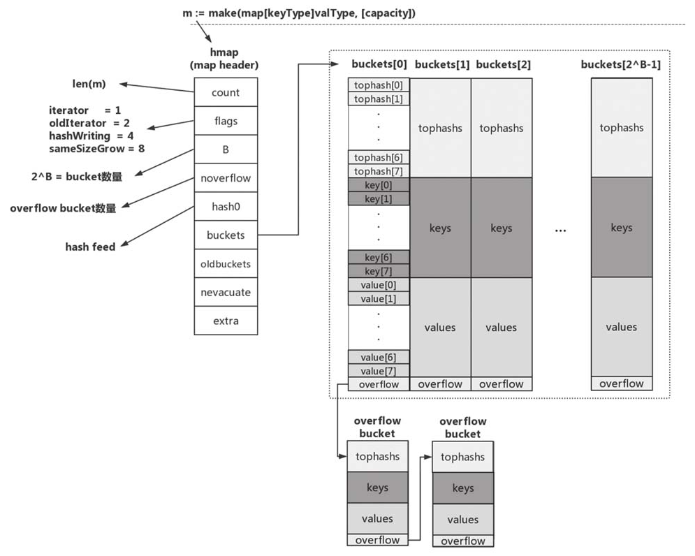
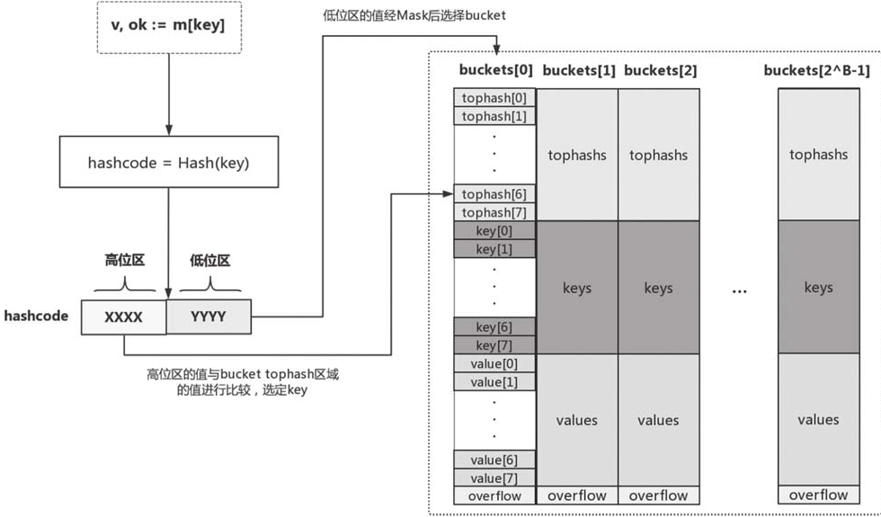

## Golang常见面试问题总结

### 一、<font color='red'>Golang</font>(以下所有源码均出自go1.17.6)


> ## 1. 数组和切片的区别

```go
go的数组相对切片类型较为严格。
1. go数组类型有两个属性：元素类型和数组长度，只有两个属性都相同的数组类型才是等价的。
2. go数组是值语义的，一个数组变量表示的是整个数组，对于元素类型长度较大或者元素数量较多的数组，如果直接以数组类型参数传递到函数中会有不小的性能损耗。
go切片在操作起来则灵活很多。
1. go切片是一个数组的描述符，保存的是底层数组的指针。
2. go切片在作为函数参数传入时，带来的性能损耗小的可以忽略不计。
```


> ## 2. 切片的实现原理，以及append的具体细节

```go
$GOROOT/src/runtime/slice.go
type slice struct {
    array unsafe.Pointer 	// 指向底层数组某一元素
    len   int 				// 切片长度
    cap   int				// 切片容量
}
```

```go
1. 当调用append函数时， 如果新切片长度未超过旧切片长度，不会发生growslice的调用。
2. 当新切片长度超过旧切片长度时，发生growslice的调用：

$GOROOT/src/runtime/slice.go
//old 为旧切片   cap 为新切片的大小
func growslice(et *_et, old slice, cap int) slice {
    ...
    newcap := old.cap
    doublecap := newcap + newcap
    if cap > double {
        newcap = cap
    } else {
        if old.cap < 1024 {
            newcap = doublecap
        } else {
            for 0 < newcap && newcap < cap {
                newcap += newcap / 4
            }
            //overflowed.
            if newcap <= 0 {
                newcap = cap
            }
        }
    }
    ...
}
```


> ## 3. map使用方法、实现原理

```go
1. map对value的类型并无限制，但是对key的类型有严格要求：函数、map、slice不能作为map的key类型。
2. map类型不支持“零值可用”
	var m map[string]int
	m["key"] = 1 // panic
3. 一定要使用“comma ok”惯用法读取map中的值。
4. 不要依赖遍历map所得到的元素次序(数据库也是，一定要用ORDER BY)。
```


```go
map的实现相比于slice要复杂的多，map在底层使用哈希表实现的。

$GOROOT/src/runtime/map.go
// hmap为map类型的描述符，它存储了后续map类型操作所需的所有信息，hmap由go运行时调用。
type hmap struct {
    count		int			// map的大小，必须为hmap的第一个字段，有len()函数使用
    flags		uint8
    B			uint8		// 整个map的大小，可以达到 locadFactor * 2^B. 目前loadFactor的大小为6.5 loadFactorNum/loadFactorDen(13/2)
    noverflow	uint16		// 大约为overflow buckets的数量
    hash0		uint32		// hash seed
    buckets		unsafe.Pointer	// 指向 2^B 个buckets的连续数组
    oldbuckets	unsafe.Pointer	// 正常情况下为空，如果当前哈希表正在扩容中，不为空。并且大小是buckets的1/2.
    nevacuate	uintptr			// 扩容阶段的计数器，所有下标小于该字段的bucket都已完成数据排空和迁移操作
    extra		*mapextra		// 可选字段, 如果有overflow bucket存在，且key，value都因不包含指针而被内联的情况下，该字段存储所有指向overflow 									 bucket的指针，保证overflow bucket是始终可用的(不被垃圾回收掉)
}
```




上图为整个哈希表的实际结构。

```go
每个bucket分为三个区域：tophash、key、和value。之所以没有将key和value放在一起是go的设计者考虑到了内存对齐，这样可以避免不必要的浪费(算法上的复杂性换来了空间上的节省，会有一半左右的空间节省率)。
```

#### 1. value的查找过程



```go
如上图所示，在查找的时候，runtime会使用哈希函数对key做哈希运算(不同类型的key哈希函数不同)得到hashcode。hashcode的低位区会匹配到对应的bucket，hashcode的高位区用于匹配tophash。具体过程为先比较hashcode的高位区域bucket的tophsash[i]是否相等，如果相等则再比较bucket的第i个key与所要查找的key是否相等，如果相等，则返回第i个value；如果不相等，则在overflow buckets中按照上述步骤继续查找。

宏观的查找过程
1. 根据key计算出hash值
2. 如果存在old table，首先在old table中查找，如果找到的bucket已经迁移，转到步骤3，否则，返回value。
3. 在new table中查找对应的value。
```

#### 2. map的动态扩容过程

```go
1. map在什么时候进行扩容？
   当count > locadFactor * 2^B 或者 overflow buckets过多时，runtime会进行增量扩容。

2. 为什么进行增量扩容呢？
   主要是缩短map容器的响应时间，如果不采用增量扩容，当map里面存储的元素很多之后，扩容时系统会卡住，导致较长一段时间内无法响应请求。

3. 扩容后的大小？
扩容会建立一个大小是原来2倍的新表。如果扩容前为2^B, 则扩容后为2^(B+1)。哈希表大小始终为2的指数倍，可以简化运算，避免了取余操作。

4. locadFactor为什么选择 6.5？
   如果扩容太频繁，会造成空间的利用率很低；如果很久才扩容，会形成很多的overflow buckets，降低查找的效率。6.5为go作者测试之后，选择的一个平衡值。
```

#### 3. 插入过程

```go
1. 根据key计算hash值，匹配到对应的bucket
2. 如果bucket在old table中，将其重新散列的new table中。
3. 在bucket中，查找空闲位置，如果已经存在需要插入的key，则更新value。
4. 根据table中的元素个数，判断是否扩容。
5. 如果对应的bucket已经full， 重新申请新的bucket作为overflow bucket。
6. 将key/value插入到bucket中。

细节：
1. 在扩容阶段，oldbucket是被冻结的，查找只会在oldbucket中查找，但不会插入新的数据。
2. 只要在某个bucket中找到第一个空位，就会执行插入操作。
3. map的设计是为插入而优化的，删除效率会比插入低一些。
```


> ## 4. map线程安全细节

```go
从上面的map实现原理来看，充当map描述符角色的hmap实例自身是有状态的(hmap.flags)，且对状态的读写是没有并发保护的，因此map实例并不是并发写安全的，不支持并发读写。如果仅仅是并发读，是没有问题的。
```


> ## 5. new和make的区别

```go
new和make都涉及到内存的分配，但两者还是存在区别的。
1. new的使用对象为值类型的，如基本类型int，float。还有结构体类型。
2. make的使用对象为引用类型，如slice，map，channel。
3. 一句话，new返回一个指向已清零内存的指针，而make返回一个复杂的结构。
```


> ## 6. string实现原理

> ## 7. channel的特性

* 给一个nil channel 发送数据，会造成永久阻塞。

* 从一个nil channel接收数据，会造成永久阻塞。

* 给一个关闭的channel发送数据，会引发panic。

* 从一个关闭的的channel接收数据，如果缓冲区中为空，则返回一个零值

  ```go
  // go通常会利用channel的广播机制，向goroutine下发命令
  ch := make(chan int)
  close(ch)
  ...
  //此时ok将变为false
  if _, ok := <-ch; !ok {
      ...
  }
  ```

* 无缓冲的channel是同步的，有缓冲的channel是非同步的

> ## 8. Golang互斥锁的两种实现：sync和channel

> ## 9. GMP调度模型

> ## 10. goroutine的原型CSP

> ## 11. GC垃圾回收

> ## 12. go tools

* go run
* go build
* go get
* go install
* go env
* go fmt

> ## 13. goroutine逃逸

> ## 14. defer的运作机制

> ## 15. sync包的使用

> ## 16. context包的使用

> ## 17. panic和recover的运作机制

> ## 18. Golang常见的并发模式

```go
goroutine: 对应CSP模型中的P， 封装了数据的处理逻辑，是Go运行时调度的基本执行单元(操作系统的基本调度单元是thread)
channel：对应CSP模型中的输入/输出原语，用于goroutin中的通信和同步
select：用于应对多路输入/输出，可以让goroutine同时协调处理多个channel操作。
```

* <font color='blue'>创建模式</font>
* <font color='blue'>退出模式</font>
  * 分离模式
  * join模式
  * notify-and-wait模式
* <font color='blue'>管道模式</font>(流水线机制)
  * 扇出模式
  * 扇入模式
* <font color='blue'>超时与取消模式</font>